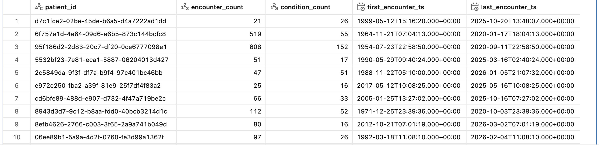
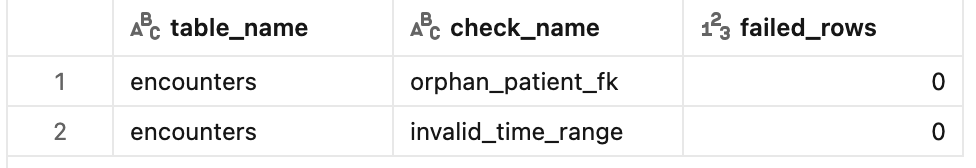

# Synthetic EHR ETL Pipeline (Synthea + Databricks)


A production-style data engineering pipeline that transforms synthetic healthcare (EHR) data into validated, analytics-ready datasets using PySpark in Databricks.

----------

## TL;DR

This project implements a production-style ETL pipeline for synthetic electronic health record (EHR) data using PySpark in Databricks.

```text
Raw CSV
(Synthea)
↓
Bronze
(raw Parquet + ingestion metadata)
↓
Silver
(cleaned, schema-consistent tables)
↓
Gold
(analytics-ready patient summary)
↓
Validation outputs
(data quality checks)
```

The goal is to simulate how healthcare data engineering pipelines transform raw clinical data into reliable, analytics-ready datasets.

----------

## Overview

This project demonstrates a realistic data engineering workflow for healthcare data:

- Ingest synthetic EHR data (patients, encounters, conditions)
- Transform raw data into clean, structured relational tables
- Validate data quality and integrity
- Produce analytics-ready outputs for downstream use

The pipeline is implemented using PySpark in Databricks and follows a Bronze/Silver/Gold architecture.

----------

## Source Data

Data is generated using [Synthea](https://synthea.mitre.org/), an open-source synthetic patient generator.

Tables used:

- `patients`
- `encounters`
- `conditions`
- `medications` (ingested but not used in downstream transformations)

The dataset contains no real patient information and is safe for public use.

----------

## Architecture

### Bronze (Raw Ingestion)

- Loaded CSV files into Spark DataFrames
- Added ingestion metadata (`ingest_ts`)
- Stored raw data in Parquet format

Outputs:

- `bronze/patients`
- `bronze/encounters`
- `bronze/conditions`
- `bronze/medications`

### Silver (Cleaned & Structured)

- Selected relevant columns
- Standardized column names (snake_case)
- Cast data types (dates, timestamps)
- Removed duplicates
- Enforced basic schema consistency

Outputs:

- `silver/patients`
- `silver/encounters`
- `silver/conditions`

### Gold (Analytics-Ready)

Built a patient-level summary table:

- `encounter_count`
- `condition_count`
- `first_encounter_ts`
- `last_encounter_ts`
- `avg_encounter_duration_minutes`

Output:

- `gold/patient_summary`

----------

## Data Quality Checks

Implemented validation logic to ensure data integrity.

- Referential integrity:
  - All encounters map to valid patients
- Temporal validation:
  - Encounter end time ≥ start time
- Duplicate handling:
  - Deduplicated records by primary keys

Validation results are stored as a table:

- `outputs/validation_results`

----------

## Example Outputs

### Patient Summary




### Validation Results



### Example SQL Query

Example aggregation using SQL in Databricks:

```sql
SELECT
    patient_id,
    COUNT(*) AS encounter_count
FROM encounters_silver
GROUP BY patient_id
ORDER BY encounter_count DESC
```

----------

## Tech Stack

- Python
- PySpark (Spark DataFrame API)
- Databricks (serverless)
- Parquet (columnar storage)

----------

## Key Concepts Demonstrated

- ETL pipeline design
- Medallion architecture (Bronze/Silver/Gold)
- Distributed data processing with Spark
- Data modeling and schema design
- Data validation and quality checks
- Healthcare data pipeline patterns

----------

## How to Run

1. Upload Synthea CSV files to Databricks
2. Run notebooks in order:

  - `01_ingest_bronze`
  - `02_transform_silver`
  - `03_validate_quality`
  - `04_build_gold`

3. Inspect output tables and validation results

----------

## Why This Project

Healthcare data pipelines require:

- Strong data quality guarantees
- Consistent schema design
- Reliable transformations across multiple entities

This project models those requirements using synthetic data, demonstrating how raw clinical data can be transformed into trusted datasets for analytics and research.

----------

## Usage Notice

This repository is shared for portfolio and demonstration purposes.

Please contact the author for permission before reusing or redistributing the code.

----------

## Author

Philippe Do
